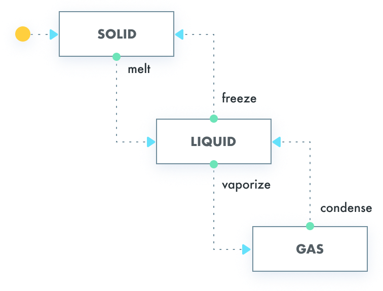

# go-statemachine

A small, focused **finite state machine** library for Go with configurable transitions and lifecycle hooks. Suitable for order workflows, approval flows, or any state-driven behavior.

**Inspired by:** [Tinder/StateMachine](https://github.com/Tinder/StateMachine)



## Features

- **Simple API**: Define transitions by source state(s), event, and destination state.
- **Lifecycle hooks**: `BeforeTransition`, `Transition`, `AfterTransition`, `OnSuccess`, `OnFailure`.
- **Handler return values**: Handlers can return an updated `TransitionModel`; the machine uses it for subsequent steps.
- **Error handling**: Sentinel errors (`ErrNilModel`, `ErrUndefinedTransition`, etc.) so you can use `errors.Is(err, statemachine.ErrUndefinedTransition)`.
- **ErrIgnore**: Return `statemachine.ErrIgnore` from `OnFailure` to swallow the error and abort the transition **without** changing state.
- **Configurable logging**: Optional `Logger` and `WithLogger(statemachine.NoopLogger{})` to disable logs.
- **Visualize**: Print a text diagram of the state machine for documentation or debugging.
- **Go module**: `go get github.com/im-adarsh/go-statemachine/statemachine`

## Installation

```bash
go get github.com/im-adarsh/go-statemachine/statemachine
```

```go
import "github.com/im-adarsh/go-statemachine/statemachine"
```

## Quick start

```go
sm := statemachine.NewStatemachine(statemachine.EventKey{Src: "SOLID", Event: "onMelt"})
sm.AddTransition(statemachine.Transition{
    Src: []statemachine.State{"SOLID"}, Event: "onMelt", Dst: "LIQUID",
})
model, err := sm.TriggerTransition(ctx, myEvent, myModel)
if errors.Is(err, statemachine.ErrUndefinedTransition) {
    // no transition for this state+event
}
```

## Full example

```go
package main

import (
	"context"
	"errors"
	"fmt"

	"github.com/im-adarsh/go-statemachine/statemachine"
)

type Purchase struct {
	PurchaseId string
	Status     string
}

func (p *Purchase) SetState(s statemachine.State) { p.Status = string(s) }
func (p *Purchase) GetState() statemachine.State   { return statemachine.State(p.Status) }

type onMelt struct{}
func (onMelt) GetEvent() statemachine.Event { return "onMelt" }

type onVapourise struct{}
func (onVapourise) GetEvent() statemachine.Event { return "onVapourise" }

type onUnknownEvent struct{}
func (onUnknownEvent) GetEvent() statemachine.Event { return "onUnknownEvent" }

func main() {
	sm := createStatemachine()
	statemachine.Visualize(sm)

	pr := &Purchase{PurchaseId: "p_123", Status: "SOLID"}

	// SOLID -> LIQUID
	if _, err := sm.TriggerTransition(context.Background(), &onMelt{}, pr); err != nil {
		fmt.Println("error:", err)
		return
	}
	fmt.Println("after onMelt:", pr.Status)

	// LIQUID -> GAS
	if _, err := sm.TriggerTransition(context.Background(), &onVapourise{}, pr); err != nil {
		fmt.Println("error:", err)
		return
	}
	fmt.Println("after onVapourise:", pr.Status)

	// GAS -> (no transition for onUnknownEvent)
	_, err := sm.TriggerTransition(context.Background(), &onUnknownEvent{}, pr)
	if err != nil {
		if errors.Is(err, statemachine.ErrUndefinedTransition) {
			fmt.Println("expected: no transition defined for this event")
		}
		fmt.Println("error:", err)
		return
	}
	fmt.Println("after onUnknownEvent:", pr.Status)
}

func createStatemachine() statemachine.StateMachine {
	sm := statemachine.NewStatemachine(statemachine.EventKey{Src: "SOLID", Event: "onMelt"})
	sm.AddTransition(statemachine.Transition{
		Src: []statemachine.State{"SOLID"}, Event: "onMelt", Dst: "LIQUID",
		Transition: func(ctx context.Context, _ statemachine.TransitionEvent, m statemachine.TransitionModel) (statemachine.TransitionModel, error) {
			fmt.Println("during")
			return nil, nil
		},
	})
	sm.AddTransition(statemachine.Transition{
		Src: []statemachine.State{"LIQUID"}, Event: "onVapourise", Dst: "GAS",
		BeforeTransition: func(ctx context.Context, m statemachine.TransitionModel) (statemachine.TransitionModel, error) {
			fmt.Println("before")
			return nil, nil
		},
		Transition: func(ctx context.Context, _ statemachine.TransitionEvent, m statemachine.TransitionModel) (statemachine.TransitionModel, error) {
			fmt.Println("during")
			return nil, nil
		},
		AfterTransition: func(ctx context.Context, m statemachine.TransitionModel) (statemachine.TransitionModel, error) {
			fmt.Println("after")
			return nil, nil
		},
		OnSuccess: func(ctx context.Context, m statemachine.TransitionModel) (statemachine.TransitionModel, error) {
			fmt.Println("success")
			return nil, nil
		},
		OnFailure: func(ctx context.Context, m statemachine.TransitionModel, _ statemachine.Error, err error) (statemachine.TransitionModel, error) {
			fmt.Println("failure")
			return nil, err
		},
	})
	// Add onCondensation (GAS->LIQUID) and onFreeze (LIQUID->SOLID) as needed...
	return sm
}
```

## Options

- **Custom logger** (e.g. structured logging or silence):

```go
sm := statemachine.NewStatemachineWithOptions(statemachine.EventKey{Src: "A", Event: "e"},
    statemachine.WithLogger(statemachine.NoopLogger{}),
)
```

- **Sentinel errors** (use with `errors.Is`):

  - `statemachine.ErrNilModel` — model is nil  
  - `statemachine.ErrUndefinedTransition` — no transition for current state + event  
  - `statemachine.ErrUninitializedSM` — AddTransition on uninitialized machine  
  - `statemachine.ErrDuplicateTransition` — transition already defined  
  - `statemachine.ErrIgnore` — return this from `OnFailure` to abort transition and return success with unchanged model  

## Output (example run)

```
######################################################
| Node :  LIQUID |
                  -- onVapourise --> | Node :  GAS |
                  -- onFreeze --> | Node :  SOLID |
| Node :  GAS |
                  -- onCondensation --> | Node :  LIQUID |
| Node :  SOLID |
                  -- onMelt --> | Node :  LIQUID |
######################################################

during
after onMelt: LIQUID

before
during
after
success
after onVapourise: GAS

expected: no transition defined for this event
error: transition is not defined
```

## License

See [LICENSE](LICENSE).

[](https://www.buymeacoffee.com/imadarsh)
